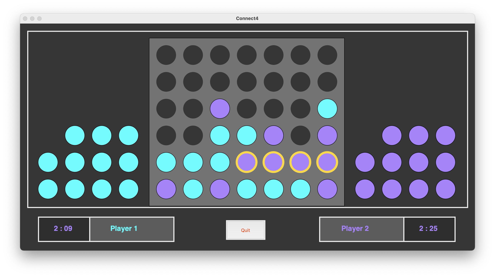

# Connect4Game

A simple **Connect 4** game developed using **Python** and **Tkinter**.



## Features
- Two-player gameplay
- Graphical User Interface using Tkinter
- Simple drag and drop mechanism with preview
- Real-time updates on the game board

## How to Run

1. Make sure you have Python installed:
   - Python 3.6 or later is recommended.

2. Clone this repository or download the source code.

3. Run the game using the command below:

   - **On Windows:**
     ```bash
     python final.py
     ```

   - **On macOS:**
     ```bash
     python3 final.py
     ```

## Authors
- [Srivishnu](https://github.com/SrivishnuGade)
- [Vishal](https://github.com/Vishal-Srinivasa)
- [Vijval](https://github.com/vijval-studio)
